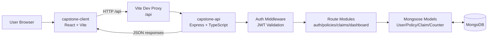
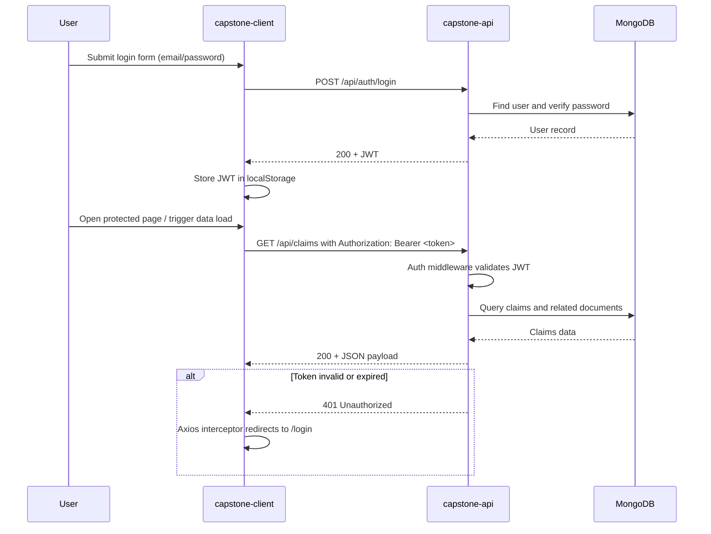

# Policy Claims Tracker Architecture

## Overview

Policy Claims Tracker is a two-application monorepo:

- `capstone-client`: React + TypeScript frontend (Vite)
- `capstone-api`: Node.js + Express + TypeScript backend
- MongoDB: persistent data store accessed by the API through Mongoose

In development, the frontend serves on `http://localhost:5173` and proxies `/api` calls to the backend at `http://localhost:5000`.

## High-Level Component Model

1. Browser loads the React app from Vite.
2. React app calls backend endpoints under `/api` using Axios.
3. Express routes validate/authenticate requests and invoke controller logic.
4. Mongoose models read/write MongoDB collections.
5. API returns JSON responses to the client.

## Architecture Diagram

## Auth Request Sequence

## Backend Architecture (`capstone-api`)

### Runtime and entrypoint

- Entrypoint: `src/server.ts`
- Startup flow:
  1. Load environment variables.
  2. Configure CORS and JSON middleware.
  3. Register API routers under `/api`.
  4. Connect to MongoDB.
  5. Start HTTP server.

### Route modules

- `routes/auth.ts`: authentication endpoints (register/login/me)
- `routes/policies.ts`: policy CRUD operations
- `routes/claims.ts`: claim CRUD + claim notes
- `routes/dashboard.ts`: dashboard/summary data

### Cross-cutting middleware

- `middleware/auth.ts`: JWT token validation and user context loading
- `middleware/validate.ts`: request validation handling
- `middleware/errorHandler.ts`: centralized API error formatting

### Data layer

Mongoose models define persistence schemas and relationships:

- `models/User.ts`
- `models/Policy.ts`
- `models/Claim.ts`
- `models/Counter.ts` (sequence support, e.g., claim numbering)

## Frontend Architecture (`capstone-client`)

### Runtime and entrypoint

- Entrypoint: `src/main.tsx`
- Root app: `src/App.tsx`
- HTTP client: `src/api.ts` (Axios instance targeting `/api`)

### UI composition

- `pages/`: route-level screens (login/register/dashboard)
- `components/ProtectedRoute.tsx`: guards authenticated routes
- `context/AuthContext.tsx`: auth state and token lifecycle

### API communication model

- Client stores JWT in `localStorage`.
- Axios request interceptor adds `Authorization: Bearer <token>`.
- Axios response interceptor redirects to `/login` on `401`.

## Security and Access Control

- JWT-based authentication for protected endpoints.
- Role-based authorization (`admin`, `adjuster`) in backend route logic.
- CORS is configured in backend using `CLIENT_ORIGIN`.
- Passwords are hashed in user model logic before persistence.

## Data and Seeding Strategy

- Primary DB connection configured via `MONGODB_URI`.
- Seed script: `capstone-api/src/seed.ts`.
- Seed behavior is intentionally destructive (`deleteMany` before inserts).
- Safety guards in seed script:
  - blocked when `NODE_ENV=production`
  - blocked unless `SEED_CONFIRM=true`

## Operational Notes

- Backend health endpoint: `/api/health`
- Frontend relies on Vite proxy for local development API calls.
- Build outputs:
  - API: TypeScript compile output in `capstone-api/dist`
  - Client: Vite build output in `capstone-client/dist`

## Repository Layout (Key Paths)

- `README.md`: monorepo landing and quick start
- `ARCHITECTURE.md`: this architecture reference
- `capstone-api/README.md`: backend setup and seed safeguards
- `capstone-client/README.md`: frontend setup and run guide
